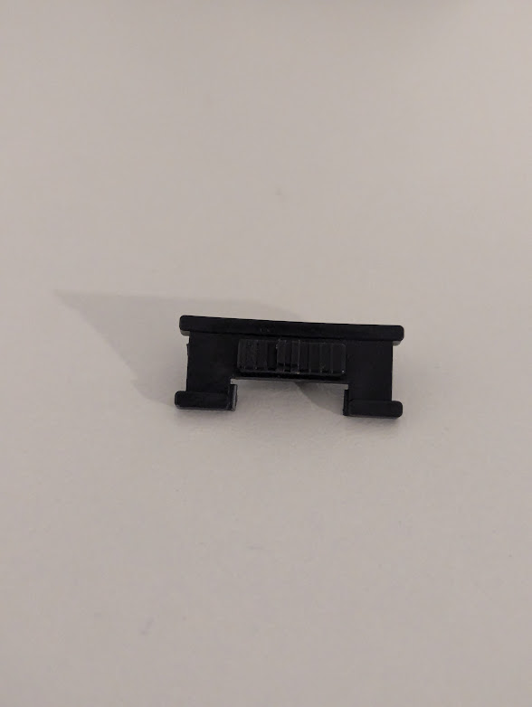
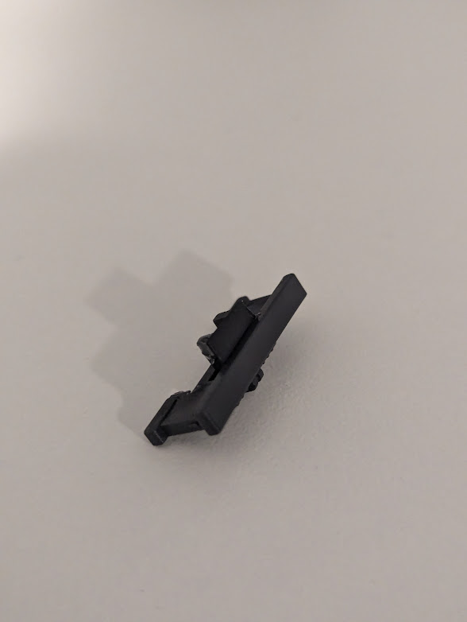

# SwiftSwitch-GBC
A momentary power switch flex-adapter circuit for Game Boy Color, using a DS Lite power switch

## BOM
|Reference|Part|Description|
|---------|------------|----------|
|U1|LTC2955CTS8-1|Pushbutton On-Off IC|
|U2|TPS22919|Load Switch with Quick Output Discharge|
|C1|1uF 0603|Input Capacitor|
|R1|100ohm 0603|Discharge Resistor|
|SW1|--see below--|DS lite-style power switch|

## Overview
The SwiftSwitch-GBC is a replacement power switch flex adapter for Game Boy Color PCBs that turns the power switch into a momentary activated, spring return switch in the style of the Nintendo DS Lite. 

This uses a "replacement" Nintendo DS Lite power switch along with 2 ICs to handle the power delivery properly.

There are two switch footprints available for replacement NDSL switches, either will work, although one with shield-ground connections will be more stable and robust. These can be found at a number of different places; typical electronics suppliers such as Mouser and Digikey, or in bulk for cheap on Aliexpress.

My footprint is based on the Diptronics SSS-12RG-V-T/R switch (available on Mouser). The C&K JSM08022SAQNR (available on Digikey) and XKB Connection SK-1391L-2 (available on LCSC) are dimensionally identical, but do not have the grounding tabs. Most of the generic replacement switches on Aliexpress have these tabs.

## Methodology
On every Game Boy system, the power switch is a major failure point and cause of a large number of system problems. The critical power path travels through the switch, specifically VCC (battery power). As the switch gets used, carbon buildup increases the resistance of the switch itself effectively adding a series resistance to the circuit larger than the internal resistance of the batteries. This can cause anywhere from battery life issues to total power failure. Additionally, as the Game Boy Pocket and Game Boy Color circuits power the audio amplifier directly from this VCC power, a dirty power switch can actually result in lower audio volume and audio buzzing/hiss/hum.

This flex actually mitigates this issue by fundamentally replacing the mechanical switch with a load switch IC.

Both ICs are powered at all times via VCC. The trigger from the physical switch goes into the LTC2955, which flips the enable on the TPS22919. The output of the TPS22919 is routed to the VCC out.

An important benefit of using this load switch IC rather than a straightforward discrete MOSFET design is the quick-output discharge function. When the stock Game Boy Color switch is switched to the OFF position, the common pin (output) is connected to ground via a discharge resistor (R1) - this quickly discharges the switching regulator which can take quite some time to reach 0v on its own. The quick output discharge function on this load switch mimics this same drain path, preventing power-up and reset problems that can result from switches that do not implement the drain resistor functionality.

This will only work on a Game Boy Color. I may route a version that works on Game Boy Pocket and Game Boy Pocket Color PCBs, or even GBA (and if so, I will link here). If you're looking for something similar for the GBA in the immediate timeframe, please check out Makho's similar project repository here: https://github.com/makhowastaken/Soft-Latching-Power-Button (using different components)

## Building

Order as a flex from [OSHpark here](https://oshpark.com/shared_projects/fACfgUZk)

Solder all of the components to the flex, then solder flex to the PCB

Lower part of the flex will overlap a few resistors on the Game Boy Color PCB

_The power switch cover will need to be modified_ - my personal way to do this is to cut the detent portion of the switch cover to allow free-sliding, and then glue a portion of that cut piece (or another flat piece of plastic) to the top of the tab fingers on the switch cover - this is to prevent the switch wiper tab from slipping over the tab fingers due to its higher vertical position on the PCB compared to the stock switch wiper

